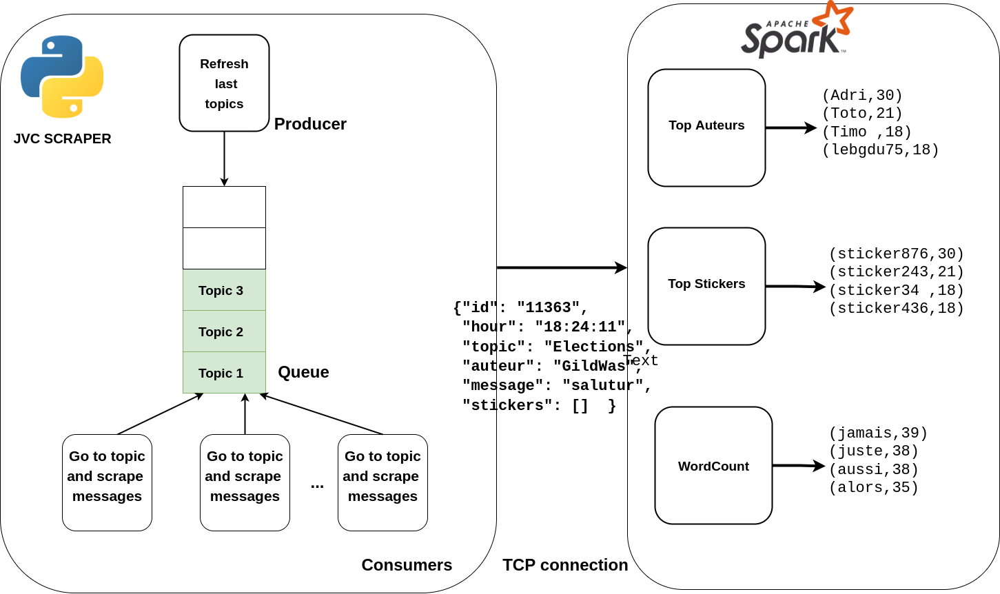

# Spark Stateful Streaming

Le but de ce petit projet est de récupérer un **flux** des messages postés sur le forum 18-25 ans https://www.jeuxvideo.com/forums/0-51-0-1-0-1-0-blabla-18-25-ans.htm (abbrégé jvc) puis d'intégrer ce flux dans **Spark Streaming** et de réaliser différentes opérations **stateful** dessus : wordCount, top Stickers (équivalent smileys) postés sur le forum etc...

# Installation

Un `docker-compose` est fourni. 

```bash
borie@branche:~$ git clone https://github.com/PaulBorie/jvc-streaming.git && cd jvc-streaming/docker
borie@branche:~$ docker-compose up -d
```
Attendre quelques secondes que tous les éléments se lancent...

## Il y 4 process Spark streaming différents qui lisent le flux généré par le scraper

### 1 - top stickers

Le code pour ce process Spark est le fichier java `/src/main/java/jvcspark/Main.java`.

Pour afficher ce flux :

```bash
borie@branche:~$ docker-logs -f stickers
```
A chaque Batch de données de 3 secondes, on compte le nombre d'occurence de chaque sticker dans les messages du flux reçu. Ce process Spark Streaming génère en sortie les stickers les plus postés (ordre décroissant) en temps réel. C'est un flux de streaming dit **stateful** car entre chaque micro-batch il sauvegarde les valeurs cumulées pour chaque stickers en mémoire pour avoir le top des stickers postés en temps réel. 


### 2 - top auteurs/posteurs

Le code pour ce process Spark est le fichier java `/src/main/java/jvcspark/Main2.java`.

Pour afficher ce flux :  

```bash
borie@branche:~$ docker-logs -f auteurs
```
A chaque micro batch de 3 secondes, on compte le nombre de message par auteur. Ce process génère donc en sortie les auteurs avec leur nombre de message postés par ordre décroissant. C'est encore une fois un flux **stateful** car on garde en mémoire le nombre de message par auteur entre les différents batchs. 

### 3 - Wordcount 

Le code pour ce process Spark est le fichier java `/src/main/java/jvcspark/Main4.java`.

Pour afficher ce flux :  

```bash
borie@branche:~$ docker-logs -f wordcount
```
A chaque microbatch de 3 secondes, on fait un wordcount sur les messages reçu dans le flux. En sortie on obtient donc un flux de tuple (mot, nb d'occurences du mot) ordonnée décroissant (on ne prend que les mots de plus de 5 lettres pour avoir des résultats plus probants). C'est également un flux **stateful**. 

### 4 - recherche pseudo

Le code pour ce process Spark est le fichier java `/src/main/java/jvcspark/Main3.java`.

```bash
borie@branche:~$ docker-logs -f pseudo
```

Recherche juste un pseudo en particulier (ici le mien) dans le flux des messages et affiche tous les messages de ce pseudo dans le flux de sortie. 
En l'occurence ce dernier était plus pour le débuggage du flux issu du scraping pour voir si ce dernier ne faisait pas ressortir des messages en double, qu'ils étaient tous pris en compte etc..

# Architecture

## Le scraper 

Le scraper est écrit en Python. Nous avons prégéré utilisé les **coroutines** python (`asyncio`) plutôt que le **multithreading** car python a de mauvaises performance en multithreading à cause du GIL : voir article https://realpython.com/python-gil/#:~:text=The%20Python%20Global%20Interpreter%20Lock%20or%20GIL%2C%20in%20simple%20words,at%20any%20point%20in%20time.

Les **coroutines** sont idéales pour l'exécution de plusieurs tâches simultanées qui sont I/O bound, c'est le cas pour le scraper qui effectue une cinquantaine de requêtes toutes les secondes. Le concept général d'asyncio est qu'un seul objet Python, appelé `event loop`, contrôle comment et quand chaque tâche est exécutée. La boucle d'événements est consciente de chaque tâche et sait dans quel état elle se trouve. Le keyword `await` peut être placé devant une tâche qui risque de durer longtemps (I/O task par exemple une reqûete réseau) et permet d'indiquer à l'`event loop` que c'est une tâche qui peut mettre du temps et qu'il vaut mieux qu'il passe à une autre le temps que cette dernière se termine. C'est le cas pour toutes les requêtes réseaux dans notre scraper, l'`event loop` peut donc attaquer les tâches de parsing par exemple en attendant les tâches réseaux. 

On a donc une **coroutine** qui rafraichit les derniers topics en boucle et les place dans une `Queue` et on a **60 autres coroutines** qui vont récupérer les topics dans la `Queue`, les requêter et récupérer les derniers messages dessus. Pour éviter les doublons, un "marque page" est placé dans une base de donnée **Redis** après chaque lecture de Topic pour sauvegarder à quel message on est arrivé. Ainsi si quelqu'un poste à nouveau sur un Topic et qu'il se retrouve à nouveau dans la `Queue` on va pouvour reprendre le scraping au dernier message traité. Grâce à cette architecture on obtient **un flux en temps réel** de tous les messages postés sur le forum (sauf erreur de réseau, pas de mécanismes de Retry) et on a pas de **doublons**. 

## Spark Streaming 

Pour intégrer le flux généré par le scraper à Spark on a choisi d'étendre la classe `org.apache.spark.streaming.receiver.Receiver` et obtenir un Stream de `Post` qui est une Objet Java représentant un post sur les forum jvc, encapsulant : pseudo, topic, message, stickers, et date du post. Notre `JvcCustomReceiver` récupère le flux du scraper en établissant une **connection TCP** avec ce dernier, les messages sont sérialisés en **Json** par le scraper python puis désérialiser en Objet `Post` par le `Receiver Java`.  

```java 
JavaStreamingContext ssc = new JavaStreamingContext(sparkConf, new Duration(3000));ssc.checkpoint(".");

//On créer un stream de Post grâce à notre custom receiver
JavaReceiverInputDStream<Post> posts = ssc.receiverStream(new JvcCustomReceiver(scraperHost, Integer.parseInt("6667")));
```

A partir du moment où on a intégré ce stream de `Post` il devient très simple de le manipuler et faire des opérations dessus comme ici on on filtre que les Post qui ont des stickers

```java 
JavaDStream<Post> withSticker = posts.filter(x -> !x.getStickers().isEmpty());
```
## Schéma




